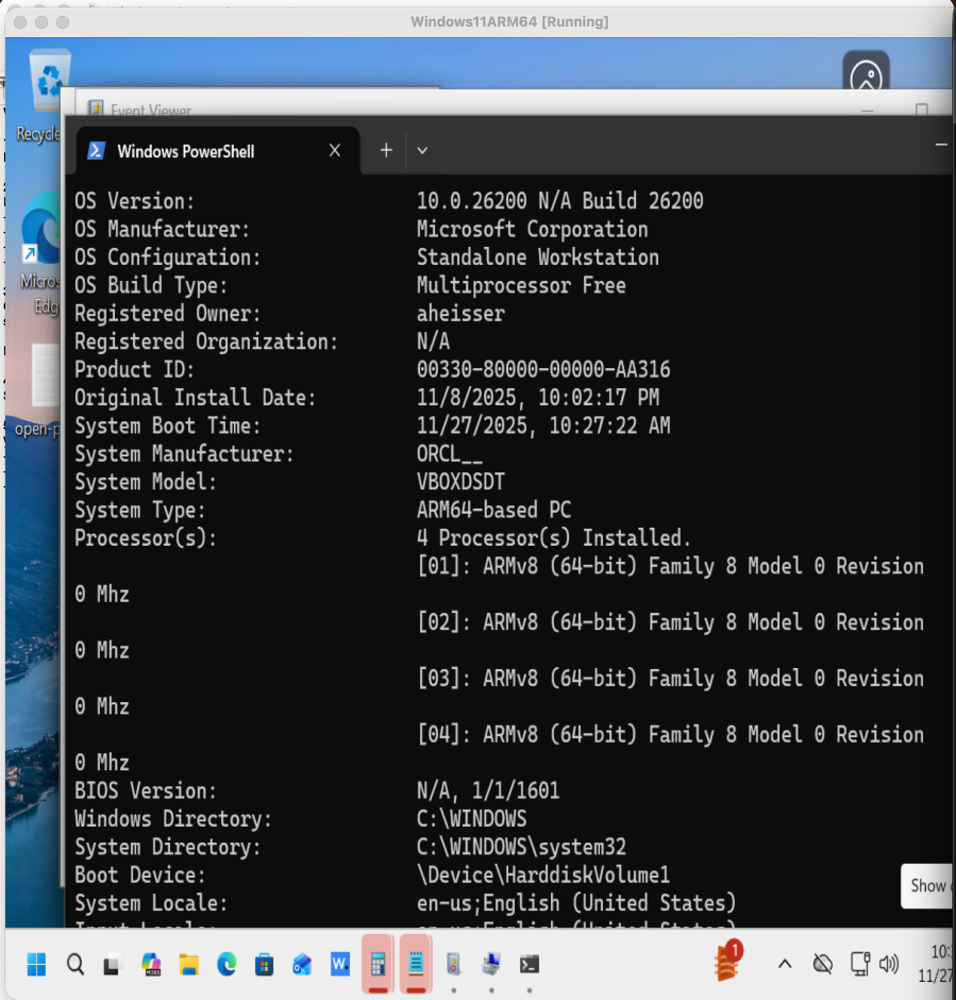
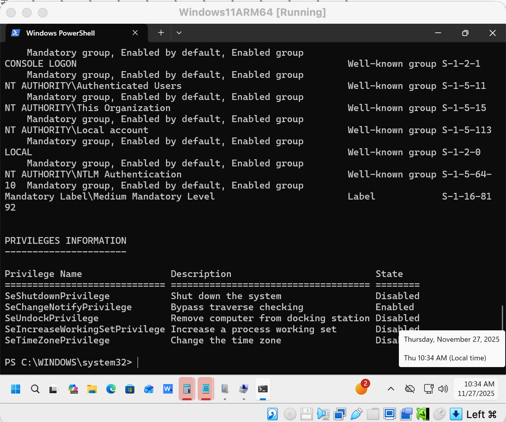
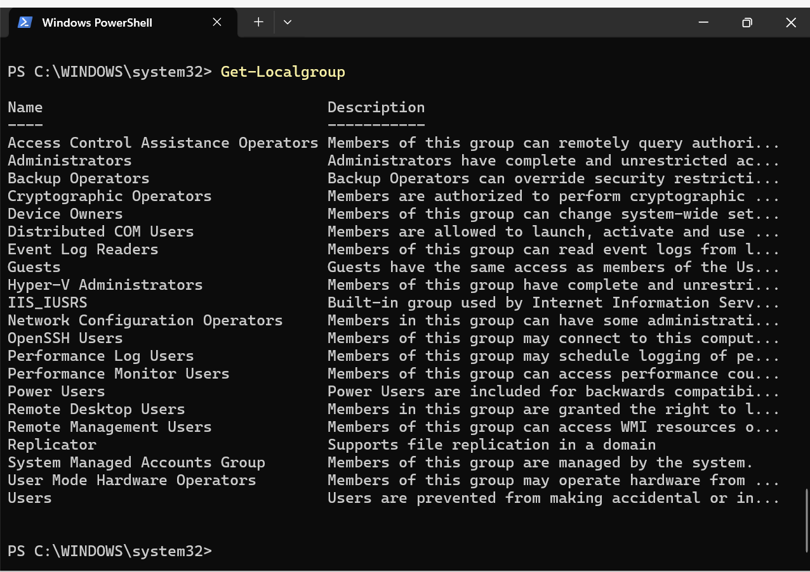
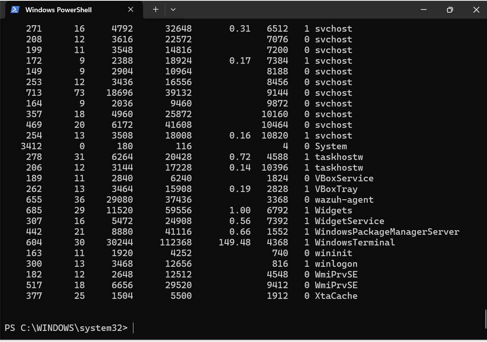
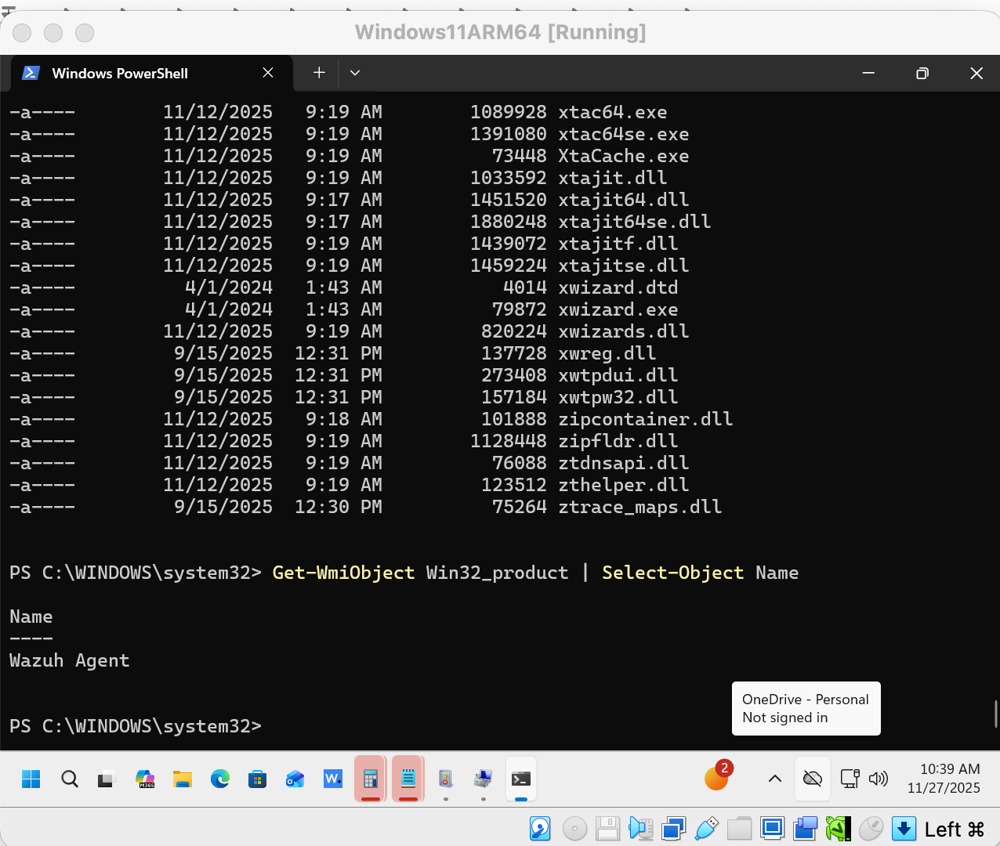
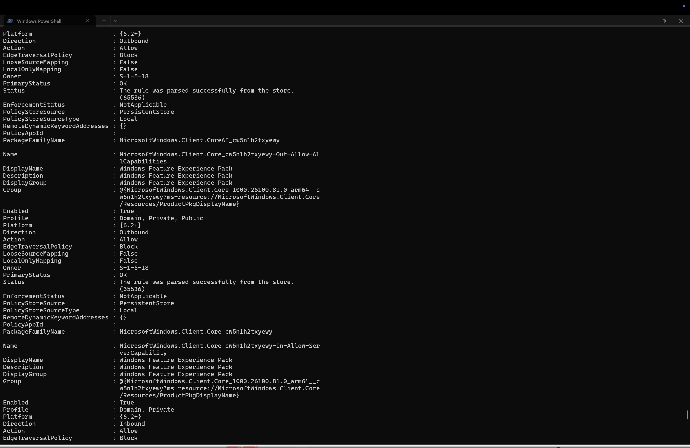
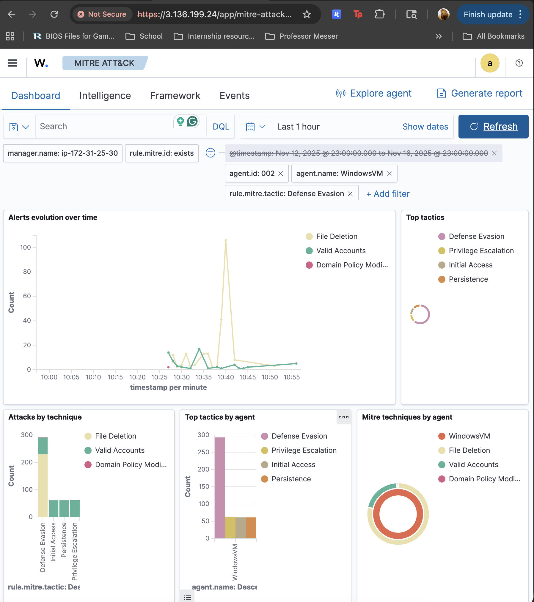
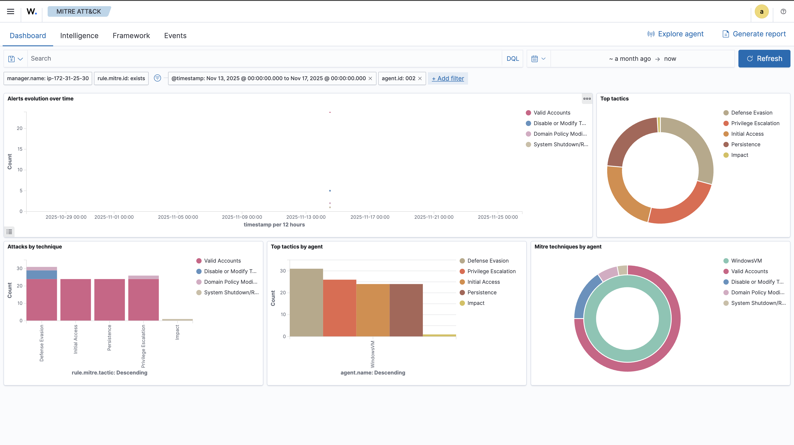

# soc-monitoring-lab
SOC Monitoring VM Lab (Wazuh SIEM)

This repository documents my home SOC and SIEM lab built using:

Wazuh manager, indexer, and dashboard on Ubuntu Server
Windows 10 VM with Wazuh agent
Simulated attacker techniques using Atomic Red Team
Log analysis across DNS, FTP, HTTP, DHCP, SMTP, and tunnel traffic

This project demonstrates practical SOC skills including deploying and configuring a SIEM, installing and managing endpoint agents, running threat simulations, performing alert analysis, and mapping detections to MITRE ATT&CK.

Lab Overview

Wazuh Manager Stack:
Ubuntu Server running Wazuh Manager, Indexer, and Dashboard

Endpoints:
Windows 10 VM with Wazuh agent
(Optional) Additional Linux agents

Traffic Analyzed:
DNS, HTTP, FTP, tunnel, DHCP, SMTP logs, and Windows Security logs

Repository Structure

soc-monitoring-lab/
README.md
documentation
scripts
logs-samples
screenshots
skills demonstrated
what I learned

Documentation Includes

Architecture overview
Wazuh Manager setup
Windows agent setup
Atomic Red Team simulations
Log analysis workflows
MITRE ATT&CK mapping

Project Goals

Build hands-on SOC experience
Learn SIEM deployment and tuning
Practice analyzing Windows and network logs
Test detection against real attacker techniques
Document findings like a SOC analyst

Future Enhancements

Add Sysmon to Windows endpoint
Add Suricata IDS
More MITRE ATT&CK coverage
Custom Wazuh rules
Full incident report write-ups
Screenshots

Windows VM – Atomic Test Execution

System Information

Privilege Enumeration

Local Groups

Process List

Installed Software

Firewall Rules

---

Wazuh MITRE ATT&CK Detections
MITRE Dashboard View 1

MITRE Dashboard View 2

Skills Demonstrated

SIEM Deployment and Configuration
Installed and configured the full Wazuh stack including the manager, indexer, and dashboard.
Established secure agent communication over TCP and verified log flow from multiple endpoints.

Endpoint Monitoring
Deployed Wazuh agents on Windows and Linux systems.
Confirmed visibility into security events, process activity, authentication logs, and system changes.

Log Analysis
Reviewed and interpreted a wide range of logs including Windows Security events, DNS, FTP, HTTP, DHCP, SMTP, and tunnel activity.
Analyzed raw logs and correlated events across multiple sources.
Used systematic investigation workflows including alert review, pivoting, timeline creation, and conclusion building.

MITRE ATT&CK Framework Application
Mapped simulated attacker activities to relevant ATT&CK techniques.
Validated coverage using Wazuh’s MITRE integration and dashboard views.
Documented techniques, detections, and visibility gaps.

Threat Simulation
Executed safe reconnaissance-style Atomic Red Team commands.
Simulated brute-force attempts, valid logins, Linux command execution, Windows service installation, and agent registration events.
Generated realistic telemetry to test detection rules and pipeline accuracy.

Detection Engineering Foundations
Confirmed baseline Wazuh rules, custom local rules, and alert levels.
Observed rule behavior for authentication failures, process execution, service installation, and PowerShell usage.

Incident Response Fundamentals
Applied SOC investigation methods including event review, context gathering, root-cause analysis, and response recommendations.
Built investigation summaries based on event data.

Linux Administration
Performed SSH testing, system updates, service management, and log file review.
Used the Linux audit subsystem and Sysmon for visibility where applicable.

Windows Administration
Executed system discovery, privilege enumeration, process inspection, and software inventory commands using PowerShell.
Reviewed Event Logs and understood their relevance to detection.

Documentation and Reporting
Created detailed documentation covering architecture, setup steps, tests, detections, and analysis.
Organized materials into a structured, recruiter-ready GitHub project.

What I Learned

Understanding of SIEM internals
Gained real experience installing and configuring a SIEM platform rather than only reading about one.
Learned how logs flow from endpoints to the manager and how alerts are generated.

Importance of endpoint visibility
Learned how essential Windows and Linux visibility is for any SOC.
Understood the value of collecting process creation events, login events, PowerShell logs, and network activity.

How attacker techniques look in logs
By running reconnaissance-style PowerShell commands and SSH-based simulations, I learned how typical adversary behaviors appear in real logs.
This made MITRE ATT&CK more practical and easier to understand.

How detections are triggered
Observed how Wazuh rules match event IDs, strings, and patterns.
Tested both default and custom rules to understand how alerts are generated.

How to investigate alerts like a SOC analyst
Learned to break down alerts, pivot into deeper logs, identify patterns, and build timelines.
Improved at asking investigative questions such as what happened before and after each event.

How to evaluate detection coverage
By mapping events to MITRE techniques, I learned how to measure detection coverage and identify improvement areas.
Gained clarity on which techniques are well-detected and which need additional logging or tuning.

Agent deployment and configuration workflow
Learned how to generate and apply Wazuh agent enrollment keys.
Understood how agents authenticate, register, and send telemetry to the manager.

Hands-on Linux and Windows administration
Strengthened experience in command-line operations, SSH usage, system configuration, and log file inspection.

How to document a technical project
Created a complete GitHub project including architecture, setup, test execution, results, analysis, and screenshots.
Learned how to explain complex security processes clearly and professionally.

Overall, this project provided practical experience across SOC analysis, endpoint monitoring, threat simulation, and SIEM operations. It served as a realistic introduction to blue team workflows and helped build confidence in detecting and investigating
